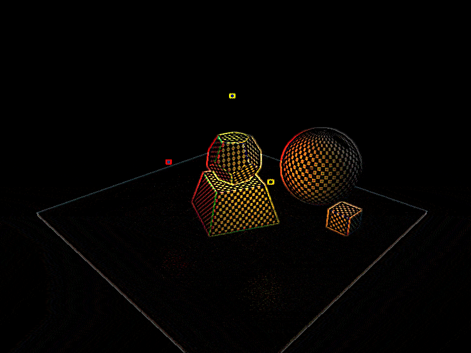
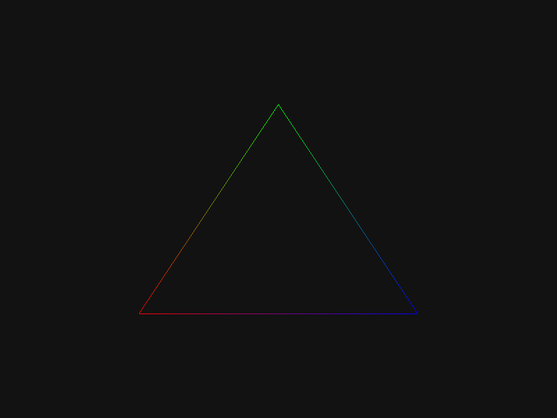

# Study-LearnOpenGL-cpp
Study project for learning OpenGL

| Project Started | Last Update     | 
| :-------------- | :-------------- | 
| 19-Aug-2022     | 13-Feb-2024     |

# Table of Contents
1. [Description](#description)
2. [Installation and Usage](#installation-and-usage)
3. [Controls](#controls)
4. [Feature List](#feature-list)
5. [Display](#display)
6. [References](#references)

# Description
This is a study repository for learning graphics programming through OpenGL.

# Installation and Usage
- This section is not yet written.

# Controls
| Key          | Function |
| :------:     | :---------- | 
| `w`          | Move camera forward
| `a`          | Move camera to left
| `s`          | Move camera backwards
| `d`          | Move camera to right
| `x`          | Move camera down
| `space bar`  | Move camera up
| `q`          | Pitch towards left
| `e`          | Pitch towards right
| `r`          | Yaw towards up
| `f`          | Yaw towards down
| `z`          | Toggle mouse control on pitch and yaw (default: disabled) 
| `c`          | Reset camera position 
| `g`          | Toggle user interface 
| `shift`      | If pressed when moving speeds up the camera movement

# Feature List
- This section is not yet written.

# Display
```cpp
0.61 Framebuffers Implementation: Convolution matrix post processing edge detection
```  


```cpp
0.49 Face culling
```  


```cpp
0.48 Transparency through blending
```  


```cpp
0.48 Outline per item
// Method 2.1 + Cleansing stencil buffer after each object draw
```  


```
0.46 Model import illuminated (diffuse, specular, emission)
```  


```
0.44 Multiple lights: 1 directional- 3 point- (rgb), 1 spot light
```  


```
0.42 Light casters respectively: directional-, point-, spot light
```  


```
0.41 Light map and emission
```  


```
0.39 Phong shading
```  


```
0.35 Static camera rotation with changing focus by time
```  


```
0.31 Perspective projection
```  


```
0.21 Pixel color interpolation
```  



# References
- Learning
    - Videos
        - [Sanderson, Grant. "Essense of Linear Algebra". _Uploaded by 3Blue1Brown, Youtube_. 2016.](https://www.youtube.com/watch?v=fNk_zzaMoSs&list=PLZHQObOWTQDPD3MizzM2xVFitgF8hE_ab)
        - [Gordan, Victor."Stencil Buffer & Outlining". _Uploaded by Victor Gordan, Youtube_. 2021.](https://www.youtube.com/watch?v=ngF9LWWxhd0)
        - [Will, Brian. "OpenGL - depth and stencil buffers". _Uploaded by Brian Will, Youtube_. 2019.](https://youtu.be/wVcWOghETFw)
    - Websites
        - Joey de Vries [learnopengl.com](https://learnopengl.com)
        - Jordan Santell [jsantell.com/3d-projection](https://jsantell.com/3d-projection/)
    - Supervision / Support
        - Volkan Ilbeyli [github.com/vilbeyli](https://github.com/vilbeyli)
- Dependencies
    - Libraries
        - GLFW | GLFW is a lightweight utility library for use with OpenGL. [Download](https://www.glfw.org/download.html)
        - GLAD | OpenGL hardware adjustment library. [Download](https://glad.dav1d.de/)
        - Asset-Importer-Lib | Importing 3d file formats into a shader, in-memory imediate format [Download](http://assimp.org/)
        - Dear ImGui | C++ gui library [Download](https://github.com/ocornut/imgui/releases/tag/v1.89.5)
        - stb_image.h | Image file load library. [Downlaod](https://github.com/nothings/stb/blob/master/stb_image.h)
    - Environment Setup 
        - Visual Studio (Main IDE)
        - Visual Studio Code
        - RenderDoc (Frame Debugging)
        - CMake
- Data
    - Phong shading predefined materials
        - OpenGL/VRML Materials. [http://devernay.free.fr/cours/opengl/materials.html](http://devernay.free.fr/cours/opengl/materials.html)
    - Models
        - Backpack by Berk Gedik [https://sketchfab.com/3d-models/survival-guitar-backpack-799f8c4511f84fab8c3f12887f7e6b36](https://sketchfab.com/3d-models/survival-guitar-backpack-799f8c4511f84fab8c3f12887f7e6b36)
        - Lantern by Rajil Jose Macatangay (polyhaven) [https://polyhaven.com/a/Lantern_01](https://polyhaven.com/a/Lantern_01)
        - Suzanne by Blender [https://docs.blender.org/manual/en/latest/modeling/meshes/primitives.html](https://docs.blender.org/manual/en/latest/modeling/meshes/primitives.html)
        - Test Objects by Kutay Coskuner (inspired by Robin Seibold) 