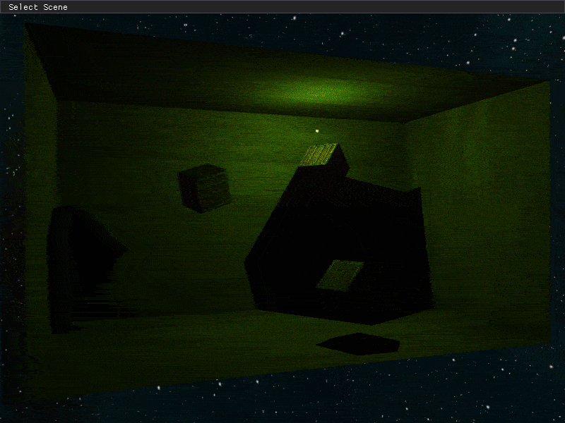
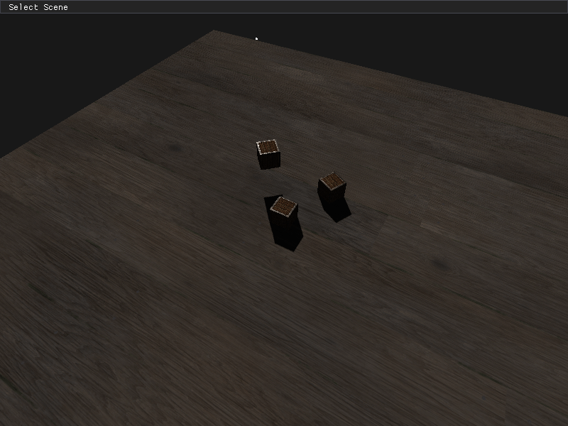
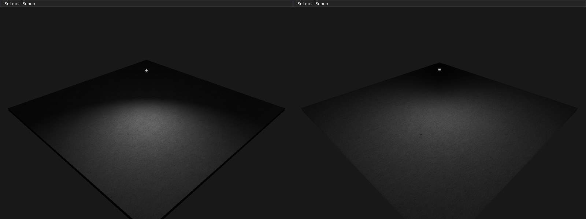
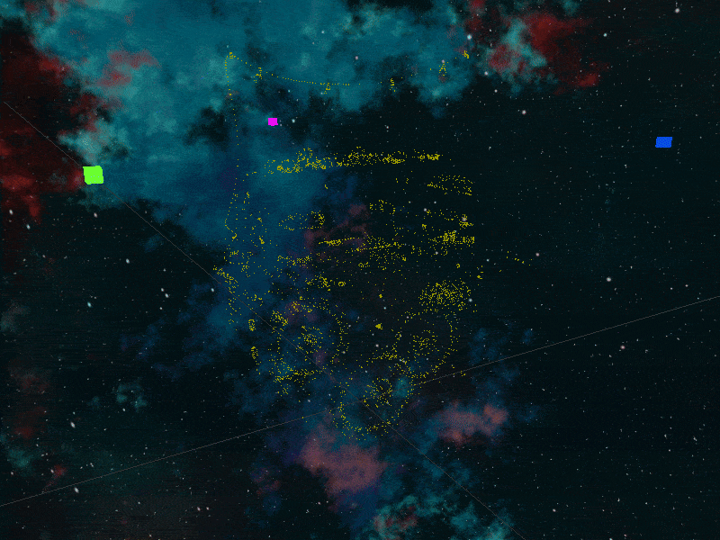
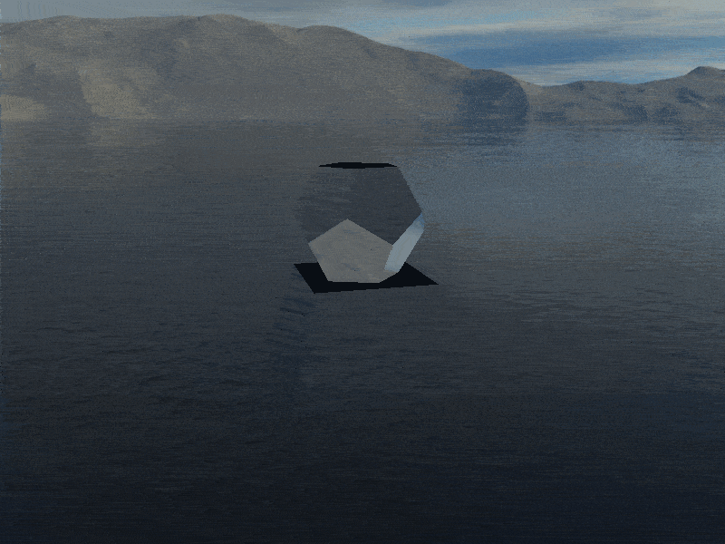

<h1 align="center">
    OpenGL Renderer
</h1>

<p align="center">
    A study project to learn computer graphics and software design principles/patterns through the OpenGL API.
</p>

<p align="center">
    
    
    
    
    
    
</p>

<p align="center">
    
    <br>
    <sub><i> 0.48 Stencil Testing and Outlining per Item</i></sub>
</p>

# Table of Contents
1. [Installation and Usage](#installation-and-usage)
2. [Controls](#controls)
3. [Feature List](#feature-list)
4. [Display](#display)
5. [References](#references)


# Installation and Usage

### Prerequisites
Before setting up and running this project, ensure you have the following installed:

- [Git](https://git-scm.com/downloads)
- [CMake](https://cmake.org/download/) (version 3.24.1 or higher)
- [Visual Studio 2022](https://visualstudio.microsoft.com/vs/) or higher (with the C++ development workload installed)
- [Windows 10 SDK](https://developer.microsoft.com/en-us/windows/downloads/windows-10-sdk/) (version 10.0.19041.0 or higher)
- [OpenGL API](https://www.opengl.org/) (usually comes pre-installed with the graphics driver)

### Installation
To install and set up the repository locally, follow these steps:

1. **Clone the repository**:
Open your terminal or Git Bash and run:
```bash
git clone https://github.com/kutaycoskuner/study_opengl.git
```
```bash
cd study_opengl
```

#### Automated Setup using `.bat` Script
2. Run the `_GenerateBuildProject.bat` script to generate the build environment:
```bash
./_GenerateBuildProject.bat
```

#### (Alternative) Manual Build with CMake
If you prefer a manual setup, follow these steps:

2. **Create and navigate to the `build` directory**:
```bash
mkdir build
```
```bash
cd build
```
```bash
cmake ..
```

### Run
#### Open Solution (.sln) File
To inspect the code in Visual Studio, open the generated solution file:
```
./build/opengl_renderer.sln
```

#### Running the Program from the Generated Binaries
After running `_GenerateBinaries.bat`, you can run the program with:
```
./bin/Windows/x64/Release/opengl_renderer.exe
```

#### Running the Isolated Packaged Instance
If you run `_PackProgram.bat`, an isolated executable instance of the program will be created in the `artifacts` directory. This directory contains all necessary files to run the program independently. You can move the `artifacts` directory anywhere and run `opengl_renderer.exe` directly.

# Controls
| Key          | Function |
| :------:     | :---------- | 
| `w`          | Move camera forward |
| `a`          | Move camera left |
| `s`          | Move camera backward |
| `d`          | Move camera right |
| `x`          | Move camera down |
| `space bar`  | Move camera up |
| `q`          | Rotate camera left |
| `e`          | Rotate camera right |
| `r`          | Tilt camera up |
| `f`          | Tilt camera down |
| `z`          | Toggle mouse control for rotation (default: disabled) |
| `c`          | Reset camera position |
| `g`          | Toggle user interface |
| `shift`      | Increases movement speed while pressed |

# Feature List
- [x] Vertex-defined shape drawing
- [x] Texture importing
- [x] 3D Perspective projection (custom 4x4 Matrix and 2D/3D Vector Library)
- [x] Moveable camera
- [x] UI movement controls 
- [x] Phong illumination
- [x] Blinn-Phong illumination
- [x] Directional, Point, and Spot lighting
- [x] Light maps and emission maps
- [x] Model importing (.obj)
- [x] Outline Shader (Depth and Stencil test method)
- [x] Transparency through blending
- [x] Face culling
- [x] Frame buffers
- [x] Uniform Buffer Object (UBO) implementation
- [x] Cubemapped Skybox 
- [x] GPU instancing
- [x] Anti-Aliasing (MSAA)
- [x] UI Scene changer
- [x] Automated frame-based scene testing
- [x] Shadow Mapping (Point light / Directional Light)
- [x] Normal Mapping
- [x] Parallax Mapping

# Display
Showcasing various rendering features and their implementation in the project.   
For more visual examples of the project's output, please check the `_display` folder.   
Below are some examples:

<p align="center">
    
    <br>
    <sub><i>0.92 Parallax occlusion mapping</i></sub>
</p>

<p align="center">
    
    <br>
    <sub><i>0.91.2 Tangent bitangent normal calculation</i></sub>
</p>

<p align="center">
    
    <br>
    <sub><i>0.90.6 Dynamic Point light shadows (Shadow Mapping)</i></sub>
</p>

<p align="center">
    
    <br>
    <sub><i>0.90.3 Dynamic directional light shadows (Shadow Mapping)</i></sub>
</p>

<p align="center">
    
    <br>
    <sub><i>0.69 Blinn-Phong / Phong Illumination comparison</i></sub>
</p>

<p align="center">
    
    <br>
    <sub><i>0.66 GPU Instancing</i></sub>
</p>

<p align="center">
    
    <br>
    <sub><i>0.64 Geometry shaders - Normal display, Explode model</i></sub>
</p>

<p align="center">
    
    <br>
    <sub><i>0.62 Cubemap: Skybox implementation</i></sub>
</p>

<p align="center">
    
    <br>
    <sub><i>0.49 Face culling</i></sub>
</p>


# References
### Learning Resources
- **Videos**
  - [Sanderson, Grant. "Essence of Linear Algebra". _Uploaded by 3Blue1Brown, Youtube_. 2016.](https://www.youtube.com/watch?v=fNk_zzaMoSs&list=PLZHQObOWTQDPD3MizzM2xVFitgF8hE_ab)
  - [Gordan, Victor. "Stencil Buffer & Outlining". _Uploaded by Victor Gordan, Youtube_. 2021.](https://www.youtube.com/watch?v=ngF9LWWxhd0)
  - [Will, Brian. "OpenGL - Depth and Stencil Buffers". _Uploaded by Brian Will, Youtube_. 2019.](https://youtu.be/wVcWOghETFw)
- **Websites**
  - Joey de Vries [learnopengl.com](https://learnopengl.com)
  - Jordan Santell [jsantell.com/3d-projection](https://jsantell.com/3d-projection/)
- **Supervision / Support**
  - Volkan Ilbeyli [github.com/vilbeyli](https://github.com/vilbeyli)

### Dependencies
- **Libraries**
  - GLFW
  - GLAD
  - Asset-Importer-Lib
  - Dear ImGui
  - stb_image.h
  - stb_image_write.h
- **Environment Setup**
  - Visual Studio (Primary IDE)
  - Visual Studio Code
  - RenderDoc (Frame Debugging)
  - CMake

### Data
- **Phong Shading Predefined Materials**
  - [OpenGL/VRML Materials](http://devernay.free.fr/cours/opengl/materials.html)
- **Models**
  - Backpack by Berk Gedik [Sketchfab Link](https://sketchfab.com/3d-models/survival-guitar-backpack-799f8c4511f84fab8c3f12887f7e6b36)
  - Kokorec by Berk Gedik [Sketchfab Link](https://sketchfab.com/models/141db37d07fc4ccba84ab5f38a8181b5/embed?autostart=1&internal=1&tracking=0&ui_ar=0&ui_infos=0&ui_snapshots=1&ui_stop=0&ui_theatre=1&ui_watermark=0)
  - Lantern by Rajil Jose Macatangay [Polyhaven Link](https://polyhaven.com/a/Lantern_01)
  - Suzanne by Blender [Documentation](https://docs.blender.org/manual/en/latest/modeling/meshes/primitives.html)
  - Jupiter by murilo.kleine [Sketchfab Link](https://sketchfab.com/3d-models/jupiter-free-downloadable-model-61671f29ca0a4fa39dc9653290282418)
