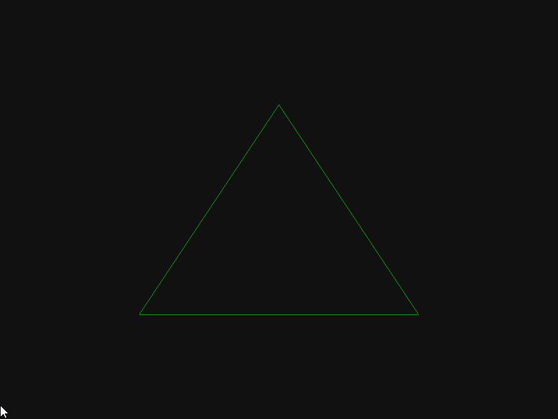

# Study-LearnOpenGL-cpp
Study project for learning OpenGL

| Project Started | Last Update | Version |
| :-------------- | :---------- | :-----: | 
| 19-Aug-2022     | 11-Jun-2023 | 0.38    |

# Table of Contents
1. [Description](#description)
2. [Installation and Usage](#installation-and-usage)
3. [Controls](#controls)
4. [Feature List](#feature-list)
5. [Display](#display)
6. [References](#references)

# Description
This is a study repository for learning graphics programming through OpenGL.

# Installation and Usage

# Controls

# Feature List

# Display

```
0.35 Static camera rotation with changing focus by time
```  


```
0.31 Perspective projection
```  


```
0.21 Uniforms: time based color shift
```  


```
0.21 Pixel color interpolation
```  


# References
- Learning
    - Videos
        - [Grant Sanderson. Essense of Linear Algebra. _3Blue1Brown, Youtube_. 2016.](https://www.youtube.com/watch?v=fNk_zzaMoSs&list=PLZHQObOWTQDPD3MizzM2xVFitgF8hE_ab)
    - Website
        - Joey de Vries [learnopengl.com](https://learnopengl.com)
        - Jordan Santell [jsantell.com/3d-projection](https://jsantell.com/3d-projection/)
    - Supervision / Support
        - Volkan Ilbeyli [github.com/vilbeyli](https://github.com/vilbeyli)
- Dependencies
    - Libraries
        - GLFW | GLFW is a lightweight utility library for use with OpenGL. [Download](https://www.glfw.org/download.html)
        - GLAD | OpenGL hardware adjustment library. [Download](https://glad.dav1d.de/)
        - GLM  | OpenGL mathematics library [Download](https://glm.g-truc.net/0.9.8/index.html)
        - Dear ImGui | C++ gui library [Download](https://github.com/ocornut/imgui/releases/tag/v1.89.5)
        - stb_image.h | Image file load library. [Downlaod](https://github.com/nothings/stb/blob/master/stb_image.h)
    - Environment Setup 
        - Visual Studio (Main IDE)
        - Visual Studio Code
        - RenderDoc (Frame Debugging)
        - CMake